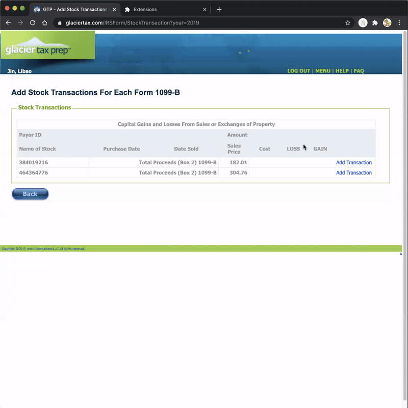

# Glacier Tax 1099-B Stock Transactions Helper

## Update 2019

I don't have access to Glacier anymore therefore cannot really maintain this repo. This plugin has helped hundreds of people like you. If you find this helpful, please contribute. Thank you!

## Description

Chrome extension for helping nonresident alien fill in the 1099-B stock transactions by importing transactions from local CSV file

## Installation

* ~~Install it here: https://chrome.google.com/webstore/detail/glacier-tax-1099-b-stock/mdnkfhpikjbgedlenpdnkhnfhdaohfcm~~
* This plugin has been unpublished from the Chrome Web Store because I am unable to verify this functionality any more.
* To use it, download this repo and install it as unpacked package. Instructions: https://stackoverflow.com/a/24577660

## Features

* Automatically validate and fill in 1099 transaction details with imported transaction details (csv)
* CSV should follow the headers 'name,acquired,sold,proceeds,cost'
* Now it enables you to auto fill multiple 1099-B forms

## Tips

* You may use Excel or Numbers to edit and then select to export as CSV format
* You may use online OCR software to help you convert non-selectable 1099 PDF to Excel
* If you use Robinhood, you may use https://jiahaoshan.github.io/Robinhood-1099-B-Transactions-Export-Tool/ to help you export transactions to CSV.
* Format for acquired date or sold date: MM/DD/YYYY
* CSV Format Example
  
  
  
  
* Live Demo
  

* Disclaimer: This is NOT an official app from Glacier Tax.
